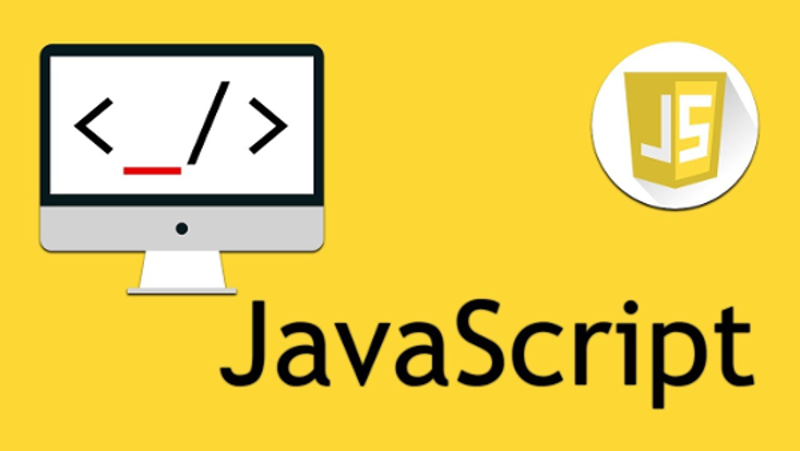

##A new semester, a new class

  As you progress through each class in the ICS program, you learn more languages. The language for my current class, ICS 314, is 
Javascript. This language is similar to the beginning language you learn in ICS 111, Java. You can basically do the same things in 
Javascript as you do in Java. Such examples would be OOP (Object-Oriented Programming) and classes. 

##Humble Beginnings

  I'll admit that I was kind of nervous learning a new programming language. It requires the memory to remember keywords and the 
syntax of the language. freeCodeCamp has made the experience on learning Javascript much easier. Once you define the semantics with the 
syntax of Javascript rather than Java then you will realize a coding languages similarities. Although each language has its own 
differences. Javascript has a different declaration for variables, which are let and const. Below you can see the side by side 
comparison of variable declaration.
Javascript 
'''Javascript
let number = 0;
'''
Java
'''Java
int number = 0;
'''

##Personal thoughts
  
  I believe that learning Java before Javascript makes it much easier than Javascript before Java. As mentioned before with the variable 
declarations is that Java needs the data type as to Javascript needs to be either a changing variable or constant variable. By 
understanding data types from Java first helps me understand what is being passed through a function or keeping tabs on my variables. If 
you only declare a variable in Javascript, then you do not quite know what the datatype is if the variable name does not give it away. 
Where as you know what the variable is at the declaration stage with Java. But what makes learning a language easier is understanding 
that programming languages contain similar syntax in which they define the same semantics in coding.
