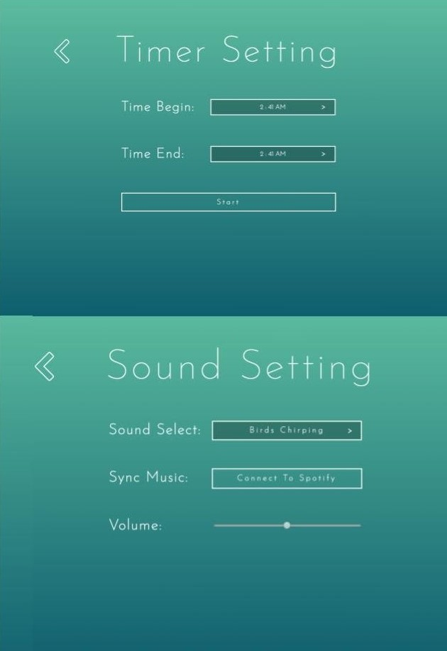
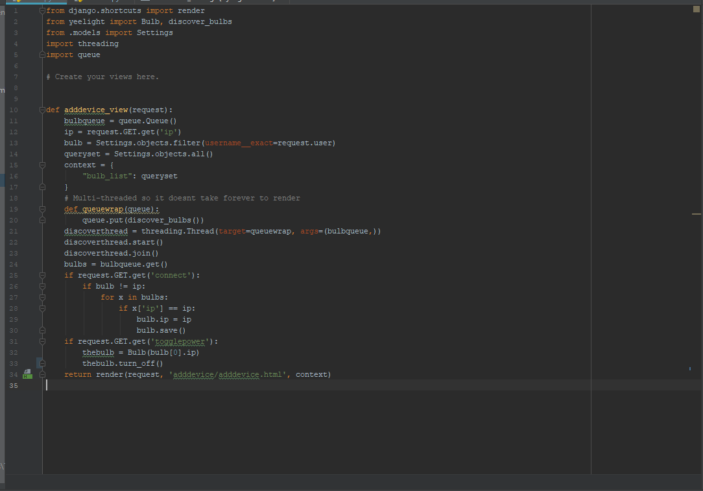

## OverView
Aura Essence is a web-app using the Django framework. In a team of three people, we 
were tasked to design and create an application that communicated with a smart light bulb. The theme of the application 
was to be an ambient style application. Its functionality was to change its themes, have an on and off timer, and play 
ambient nature sounds. This was my first time coding with Python and Django. Due to the win32api package no longer being supported, 
the code is currently deprecated.

## Contributions
Apart from collaborating with my team to design the app, I coded the functionality 
of the timer, sound, add device features, and some of the login functionality. I also structured the models for the data.

### Timer
This feature was a simple timer function for the light bulb. You can set a start time 
and end time. The start time indicates when the light bulb will turn on and the end time indicates when the light bulb will
turn off. Nothing changes if the light bulb is already on until the end time. 

### Sound
The sound feature is a simple sound playing functionality. There is a list preset 
sounds to choose from. All of the sounds are nature related to give off an ambient feeling. From working with this feature,
I learned that it is good to be aware of device compatibility. The package I used to play the sounds was for windows only 
devices. My teammates could not make the feature work on their Macs.

### Add Device
Coding this functionality helped me learn about Python and Django. I had to work with
GET and POST requests to a database to either get data to display or manipulate data in the database. The code adds IP's 
of the light bulbs to a user data structure if not already added by the user. This is where the data to connect the bulb 
to the wifi that your device is connected to is saved.

## Links
[Source Code (Deprecated)](https://github.com/teamjst/aura-essence)