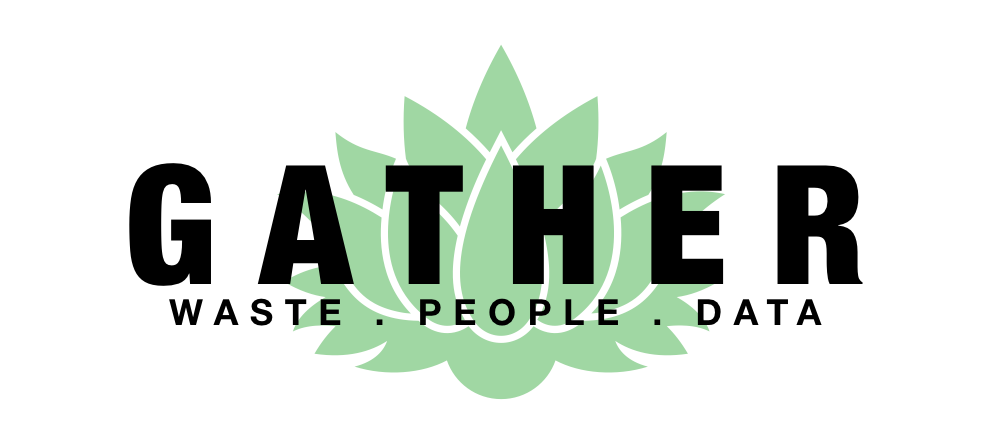

## Gather
### Overview
&nbsp;&nbsp;&nbsp;&nbsp;&nbsp;&nbsp;The 2018 HACC's theme was sustainability, which led to the app, Gather, being born. The kick-off even on October 20th, 2018 showed us 7 different challenges where programmers of a variety of skills would band together to get one of the challenges done. The challenge I chose for this competition was the Waste Audit challenge. This challenge was attempted with 6 other members during the entirety of the month. We managed to get 8th place overall out of 20 presenting teams and 30+ entering teams.

### Waste Audit
&nbsp;&nbsp;&nbsp;&nbsp;&nbsp;&nbsp;What is a Waste Audit you say? These Waste Audits are events held by the University of Hawaii's Office of Sustainability that go through trash and collect data through the trash. This data will provide useful information on trends of students or even give ideas to new implementations to lower the waste. Such examples could be reusable straw and cup sales to lower Starbucks cups and straws if those trash become a problem. These events take the saying "Another man's trash is another mans treasure" to a whole new meaning.

### Experiences 
&nbsp;&nbsp;&nbsp;&nbsp;&nbsp;&nbsp;This was the first time I worked as with a team and developed an app. This app took much time and energy to finish. There were many hurdles to overcome. I started out as a research team member as I was not doing this app for my final project. I had the responsibility of doing research in looking for libraries that will make our coding lives easier and implementing them. Then due to unseen circumstances with our current UI lead being sick, I was bumped up into the UI lead position. This position gave me struggles of coordinating multiple people and being patient with helping my fellow members in helping them. It was good experience, although a failure because I learned from the experience and it was better that I fail now in school than in the future in my career as a programmer. I learned that I must go through more experiences to find my own methodology of solving the problems I had in the team. Even the experienced programmers did not have a concrete answer to my problem as there are many solutions but the most optimal one is hard to determine.

### Contributions
&nbsp;&nbsp;&nbsp;&nbsp;&nbsp;&nbsp;As UI lead, I helped plan the layout of the app, helped members in solving their coding problems, the NavBar, parts of the pitch/presentation. I was also in charge of looking through pull requests and fixing merge conflicts. 

## Links
- [The app](http://gather.meteorapp.com/#/)
- [GitHub Link](https://github.com/HACC2018/The-Johnson-Family)