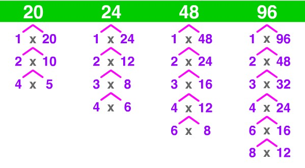

  This program was to help get used to the input and output of the language C. This program takes in an integer and displays the factors 
of the integer given but it also detects wrong input, such as letters. I contributed all of the code. This assignment has helped my understanding and practice the scanf function with the printf function. I had to work with loops for detecting wrong inputs and keeping the programming continuing even after one input until an integer is given. Also like all other assignments, learning to code from instructions. Not all customers are going to know coding, so asking questions and interaction is good when instructions aren't clear.

example of mentioned loop below.
```C
  while (aboveZero == -1)    
    {
        while((letters = scanf("%d", &num)) != 1)
        {
            if (letters != 1)
            {
                charDump = getchar();
                printf("\n%c removed! Enter an integer greater than zero\n", charDump);
            }
        }
        if (num > 0)
        {
            aboveZero = 1;
        }
        else
        {
            printf("\nERROR : Integer %d is not greater than zero!\nEnter an integer greater than zero!\n", num);
        }
     }
```
This loop shows that I had to understand that there was some sort of buffer before the information is printed. Also that if there is
wrong input, then the wrong input stays in the buffer and your program is bugged. Basically, the function scanf, printf, and the
input buffer is the main concept of this homework. It is learned that I need to "dump" the wrong input so that the scanf loop can read
the next input in the buffer. It is not intuitive when the professor doesn't explain
too much and wants us to ask for help. This is crucial and similar as to asking your customer if instructions are unclear or even
problem solving by yourself if you don't ask questions. 

Homework : https://github.com/TysenImaiToyama/TysenImaiToyama.github.io/tree/master/projects/Homework1
