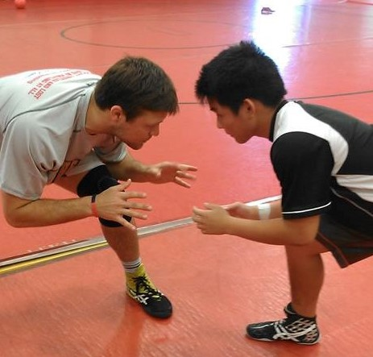

  For this significant endeavor in my life, I have attained a variety of experiences. Such experiences consist of hard-work,
self-discipline, and encouragement as a team. Both sports have been impactful in my life as to how I want to work in the work force.
The hard-working aspect was that wrestling is not an easy sport. I've trained hard for that sport, which like an instrument, needs a lot of time to perfect form and developing your body and mind. Perfecting form is like hitting the note perfectly and developing the mind and body is like the muscle memory and the strive for victory or a good performance. Both sports have taught me self-discipline in which I need prioritize my grades as well as the sport. Also not fooling around at practice or making each practice as efficient as possible.
Team encouragement plays a role when teammates are in a match or struggling through conditioning. Its basically establishing comradery and 
having no teammate left behind.

  I achieved these expreriences by participating in Judo all four years of high school and Wrestling in the last 3 years of high school.
I sacificed my high school life to train in those sports. Not many people could handle wrestling practices at my school and the 
team was always small throughout my years there. Unfortunately, I've only been able to achieve 3rd place in Easterns. I could have been hanging with friends or having fun but I decided to try and accomplish something with my life. I now apply the self-discipline and other experiences to my jobs after high school.
